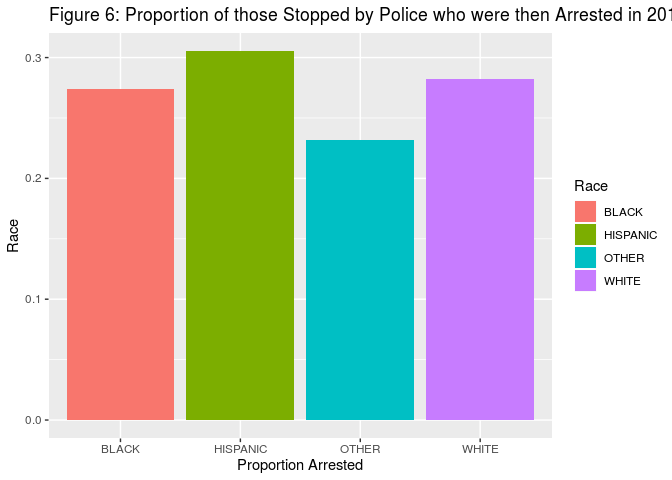

Math-285: Stop-and-Frisk In NYC
================

### Intro

The highly controversial 1968 *Terry v. Ohio* Supreme Court case ruled that police officers, even when lacking probable cause for an arrest, can search someone's belongings (aka "frisk") in order find weapons if the officer suspects that the person being searched is armed and dangerous at the time of the search. This ruling set the stage for the policy that would later be known as stop and frisk to be put into law in New York City. Despite criticism leveled at the program, it was not put in place without reason. Along with many other police reforms of the time, this new course of action was part of a "broken windows" theory of crime prevention. This theory posits that the best way to prevent crime is to crack down on so-called low-level offences, because those crimes create an environment in which more serious breaches of the law become more acceptable or commonplace. In the modern age, proponents of stop and frisk (or other similar policies) argue that by showing low-level offenders the consequences of their actions before they partake in serious crime, more dangerous crimes will be discouraged. While these may seem to be reasonable theories for preventing crime, the actual execution of stop and frisk was anything but ideal. Perhaps foremost among the problems with the implementation of stop and frisk was the sheer number of stops that occurred. At their peak in 2011, about 685,000 stops occurred in a single year. Furthermore, many of those stops (over 80%) did not result in an arrest (see the NYCLU website's page for this data at <https://www.nyclu.org/en/stop-and-frisk-data>). To add to the mess, accusations that the police were racially profiling young African American and Hispanic men were rampant. These accusations were not just hot air, either. The 2013 case Floyd v. City of New York ruled that stop and frisk had been used in a racial discriminatory and thus, unconstitutional manner. Since that time, the number of reported stop and frisk cases has dropped precipitously. However, questions about the current state of policing in NYC still remain. Is racial profiling still occurring? How many stops happen in a year? How successful are these stops at finding and arresting criminals? These questions, and many others, are the focus of this project.

### The Data

Our data is taken from the New York Civil Liberties Union (NYCLU) website at <https://www.nyclu.org/en/stop-and-frisk-data>. The data is collected for the purpose of understanding how and why stops occur. In particular, the NYCLU is interested in the racial disparities in the use of policies like stop-and-frisk. However, there are several important flaws in how this data is collected. First, it is self-reported in three different ways. Each case is a record created by an officer (or group of officers) which may be biased in what information they include or how that information is presented. While idiosyncratic biases might be washed out by the size of the data set, systemic bias may produce patterns in the data which are not reflective of the reality of police interactions with ordinary people in NYC. Some of this data is also self-reported in the sense that it is reported by those who are searched, for example, no "age" category is in the data set; instead, there is a "reported age" category. Furthermore, this data as a whole is turned over by a department, which may have incentives of its own to conceal and manipulate facts this data can convey. The exact extent (or existence) of any systemic manipulations in this data set are beyond the scope of this project. However, especially when it comes to choices made by officers (such as whether to search or arrest someone), there may be systematic biases that distort these data as compared to the real world.

Thus, for example, it is difficult to say that a stop is 'successful' if it results in an arrest, because factors that result in an unneeded stop may also result in an unnecessary arrest. Furthermore, such errors may well be systemic; for example, it may be that some communities are targeted for arrest at disproportionately high rates. Furthermore, as part of a "broken windows" strategy, many encounters with the police may be the point of continuous stops in a certain region or among a certain community, simply because it sends the message that law enforcement are constantly on the lookout for any crimes (or criminals). In this way, limitations in both the data set (convictions are absent here, for example) and in knowledge of future behavior of both police and those stopped by police, render certain types of questions quite difficult to answer. However, there is still some merit to using what data is available to dig into the behavior of NYC residents and the police officers that serve the city.

This data, as it was collected and reported by humans about humans, is somewhat messy and difficult to work with. One example of this is the way that "no value" was reported. Usually, such would be reported as "NULL" or just as two commas with nothing separating them in a csv file. However, this database uses "(null)" (quotes included), which is somewhat idiosyncratic. We needed to change those into actual null values before further analysis could take place. To add insult to injury, these nulls are quite common in the data--to the extent that there is no row which does not have at least one null in it. This makes certain types of analysis (for example, predicting when those who are searched will also be arrested) somewhat challenging. It is also unclear what these nulls actually mean--it could mean "nothing reported", but it could also be a short way of noting whatever the 'default' value is for some variable. For example, if there is a null where arrests are noted, that probably means that no arrest took place. However, if there is a null in "suspect's sex" it is unclear what that corresponds to. Considerations like these had to take place on a variable by variable basis, which slowed down analysis significantly.

### Results

Let us first consider when people are most likely to get stopped. From the perspective of police officer, it would be nice to determine when stops are most likely to lead to arrests. However, from the perspective of an ordinary citizen, it would be nice to avoid having to be stop-and-frisked by a police officer. Thus, we will consider both perspectives.

Let us first consider when in the day stops tend to occur. The number of stops performed by police does seem to vary by time of day, but we were curious to see if the pattern of stops would change based on the season. So, we split up months into winter, summer, and other months, and considered the number of stops made by hour of the day in winter and summer months. On close examination, we can see that there is a noticeable peak in stops during the early evening, although the exact time varies according to the time of year. In the winter, the peak time tends to be roughly 5:00 PM, while in the summer, the peak is a few hours later. Furthermore, there is also a consistent dip in the number of stops in the very early morning, although that dip is more pronounced in the cooler months. This makes sense; the early evening is a time when many people leave their homes to eat out or do other activities throughout the city, while relatively few people will tend to be out of bed in the early morning. In the colder months, people will avoid going outside in the coldest parts of the day (the early morning) even more than usual; during the summer months, people may tend to stay out later in larger numbers than during the winter.

To see how correct this guess is, we can look at the number of stops performed in 2018 over the course of the year. We can see that indeed, fewer stops are made during the winter months. In particular, December seems to be a low point for number of stops, which may be because it has many winter holidays which keep officers and people off the streets. One thing to note is that these trends in police stop-and-frisk occurrences might be explained by the natural ebb and flow of people being outside. On the other hand, it may be that police officers are more reluctant to stand outside searching for criminal activity in the winter months as compared to summer months, or that conditions such as icy roads or adverse weather conditions may impede the type of police activity that leads to stops. Further, it may be that similar numbers of people are on the streets in NYC in the early morning (it is the city that never sleeps, after all) but that the number of police officers outside at that time is diminished. Thus, if one wishes to avoid being stopped by police (for whatever reason), it may at first seem reasonable to sneak outside in the very early morning. However, it may be that among people outside at, say, 3:00 AM, a higher proportion of people are stopped by police as compared to people who are outside during the evening. Without data on when NYC residents tend to be outside in large numbers, it is difficult to draw any concrete conclusions about when people are most likely to be stopped.

If we then take the other viewpoint (trying to maximize stops that lead to an arrest), we can see that the arrest proportion for all times is relatively low (no more than 40%). Further, the difference in arrest rates across hours of the day is also relatively low, ranging from roughly 20% to roughly 35%. However, certain times do tend to be more arrest-prone than others. For example, the early morning (between 3:00 and 5:00 AM) has all the times with the highest proportion of arrests. If we consider that very few people are up and about at that time of day, this effect is compounded. Therefore, if what police officers want is to increase the number of stops in the way that best increases number of arrests, we can see that increasing efforts in the early morning is a good candidate for when that increase should be made.

Taking a brief look at days of the week, there do appear to be fewer stops made on certain days of the week, namely Sundays and Mondays. However, there does not appear to be a pattern in stops by weekday beyond that fact, nor does there appear to be a strong pattern in when more arrests tend to be made. Again, it is difficult to determine what is responsible for this (lack of a) trend. One possible explanation is that while fewer people are out and about on Sundays and Mondays as compared to the rest of the week (which might apply to the police as well as the general population), neither number of people outside nor number of crimes committed vary that much by week day.

### Race and Sex

Much of the furor over the NYC stop-and-frisk policy (and similar policies elsewhere) is due to the perception of racial bias in how stops are carried out. We want to determine if evidence of this bias still exists in the 2018 data set. We first must consider what "evidence of racial bias" might be. One possible piece of evidence is a disproportionate number of stops performed on members of some community (as compared to that group's prevalence in the overall population). We know, for example, that the proportion of NYC that is African American is roughly 25% (NYCLU), and the proportion of Hispanic people is roughly 27%. If the proportion of those stopped who are African American or Hispanic is significantly higher than their proportions, we can determine that there is likely to be bias in what people are stopped by police. To answer this question, we first had to remove unrecorded values (nulls) from the data set. Then, we had to combine different "race descriptions" into racial groups. Finally, we simply need to count the number of individuals in each racial group.

So what did we find? Well, as you can see in Figure 5, the largest racial group by far is "Black", followed by Hispanic people (both black and white Hispanic people). The proportion of African Americans in these data is roughly 57%, well above their proportion compared to the total population of NYC. For Hispanic people, the proportions are closer, with a 31% stop rate and a 27% proportion in the population. This indicates that both Hispanic and African American NYC residents may be overpoliced, although African Americans significantly more so (by this measure). Note that this is not a claim about the actual number of stops made for each racial group, merely a measure of the stops of a racial group as a proportion of the total number of stops. If we consider White people for a moment, we can see that their stop rate of roughly 10% is well below their proportion of the population of (roughly) 45%. This indicates a significant under-representation of white people in this data set. Drawing conclusions from this is difficult, however, as we don't have the evidence to say that white people are "under-policed".

Another possible measure is the proportion of arrests made among people of a certain group as compared to another. There are two possible uses for this information. If we knew the real crime rate among different groups, we could compare the arrest rate and the crime rate to see if there was bias in arrests. Unfortunately, we lack access to that data. Therefore, we must take the second approach, and consider the arrest rate as an indirect measure of the crime rate, keeping in mind that a bias which causes over-stopping is likely to also cause over-arresting. However, even with that caveat, ff the arrest rate for a certain group is comparable to another, but they are stopped at very different rates, we can say that there is an indication of bias in the occurrences of stop-and-frisks.

We can see in Figure 6 that the proportion of those stopped who are then arrested does not vary much in comparison to the variation of the number of stops performed on each group. All arrest rates are roughly the same, with Hispanic people having the highest at roughly 30%, and Other racial groups being the lowest at roughly 23%. This is important because, if we take arrest rates as a signal in crime rates, it indicates that there is little natural variation in actual crime rates across racial groups. This is further evidence that African American NYC residents are subjected to too many stops when compared to, say, white NYC residents.

As a quick aside, let us consider sex for a moment. Looking at Figure 7, we can see that the number of men stopped by police is much higher than the number of women so stopped. In fact, men make up roughly 91% of this data set, which is very different from the roughly 50% of NYC residents who are male. Further, if we consider the ratio of stops to arrests for men and women as we did for race, we can see that the proportion of women stopped who are then arrested is roughly 31%, slightly higher than the same proportion for men at roughly 28%. Therefore, we can conclude that there is reason to suspect that men are overpoliced, as compared to women.

### Location

This was meant to be Allegra's part of the work, so I have not done much here. We were planning on having the interactive graphic here, so I have added a simple placeholder in case things go awry.

Another Consideration one might make is where stops and arrests tend to occur. Note that "NA" here means "not recorded", which is useful information we should display, as it shows where police might not record information thoroughly. Use the following interactive infographic to find that out for yourselves!

A simple analysis shows that there is a large group of stops, and in those groups, most of those stopped are Hispanic or African American. This suggests that part of the reason those races are so over-represented is where police stops usually take place.

### Predicting arrests.

Again, this was the part of the project that Allegra was working on. We have a simple decision tree which predicts who will be arrested. This may, for example, help police officers better target stops to those who are most likely to later be arrested. If successful, this would reduce police workload as well as unneeded friction between the police and the population they serve. Thus, we only use those predictors which the police could be expected to observe before a stop is made, such as stop location and suspected crime.

However, as you can see, suspected crime is the most important factor the tree considers. This holds up even if we slightly change which predictors the tree can access. Thus, police officers should limit their stops based on what type of crime they suspect a person (or group) of committing.

### Conclusion

Again, this was mostly going to be Allegra's part.

From our investigation, we found that the number and proportion of stops depend on the time of day, in a pattern that varies according to the season, with colder months generally having fewer stops (especially in the early morning). We also find that there is a disproportionately high number of stops performed on African American (and to a lesser degree, Hispanic) residents of NYC, despite the fact that these stops do not have a higher proportion of arrests per stop than for other racial groups. Finally, we noticed that stops tend to occur in certain areas of NYC, and that this may explain (in part) why so many African Americans were stopped in 2018.

.

.

.
